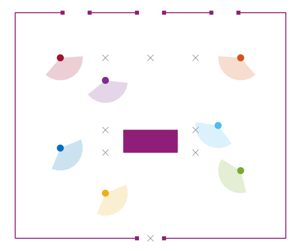
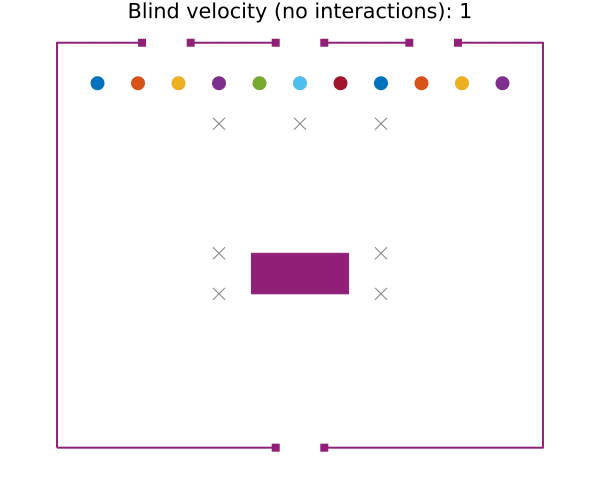

# Pedestrians.jl

[](https://github.com/VaclavMacha/Pedestrians.jl/blob/master/LICENSE)

Simple package for modeling pedestrians movement.

## Instalation

Package is not registered and can be installed using Pkg REPL as follows

```julia
(@v1.6) pkg> https://github.com/VaclavMacha/Pedestrians.jl
```
## Tutorial



### Blind velocity

```julia
using Pedestrians, Plots

# create model
model = build_model()

# run simulation
@time anim = @animate for i in 1:500
    title = string("Blind velocity: ", lpad(i, 3, " "))
    makeplot(model; title, addview = true)
    simulation_step!(model)
end;
gif(anim, "./assets/blind_velocity.gif", fps = 10)
```

